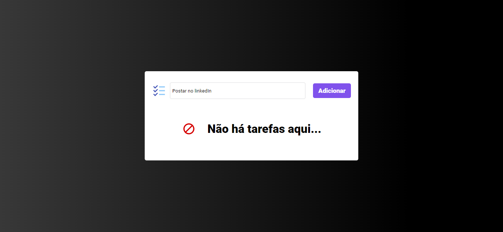
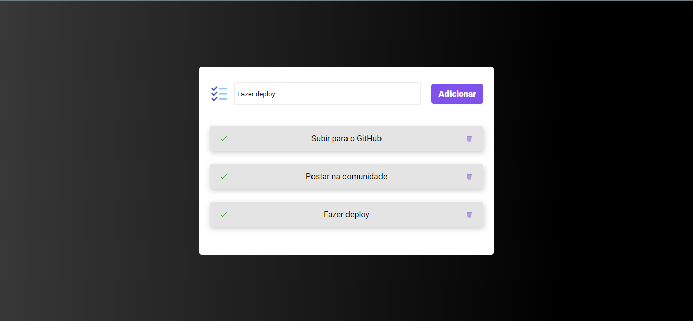
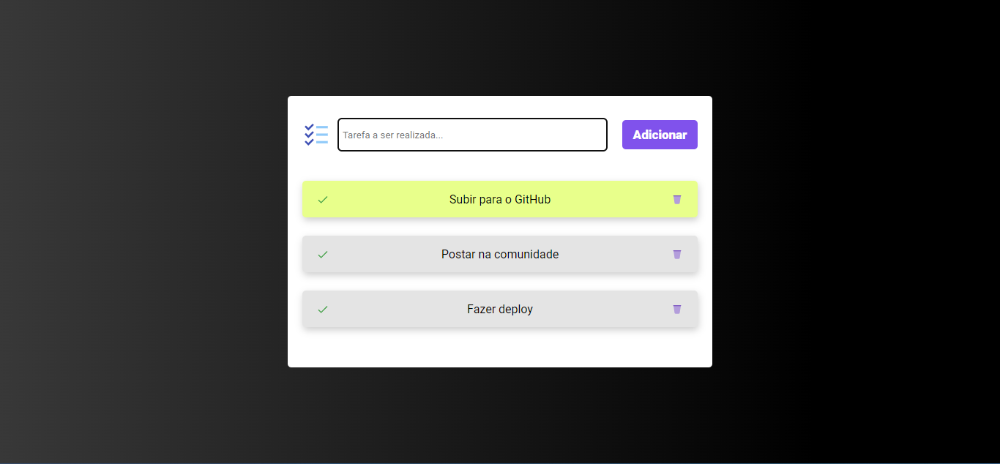

# Lista de tarefas

## Descrição:

    Este projeto, desenvolvido com React JS, se trata de uma lista de tarefas, utilizando o conceito
    de CRUD, onde o usuário pode adicionar, listar, atualizar e deletar as tarefas.
    Para adicionar a tarefa, basta digitar no input e clicar em "Adicionar".
    Ao concluir uma tarefa, o usuário pode apertar o ícone "check" e ela já muda de cor, atualizando 
    a mesma. 
    Ao pressionr o ícone da lixeira, a tarefa é deletada.
    Este projeto foi desenvolvido utilizando o VITE, pois oferece mais agilidade ao rodar utilizando
    o servidor local, o que deixa o desenvolvimento mais fluido.

 

### Resultados do projeto:

    
    
    

 
 

### 💻⚙️ Tecnologias utilizadas:

 

### Criação:
> npm create vite@latest

### Rodar a aplicação:
> yarn dev

### Clonar o repositório:
> git clone https://github.com/gGtEriKk/ToDoList.git

 

### 📚 Bibliotecas utilizadas:

> react icons;
> styled-components;
> uuid;
> eslint;

 

<table>
  <tr>
    <td align="center">
      <a href="https://github.com/gGtEriKk">
         
          
            <b>Erik Gomes</b>
          
      </a>
</table>
